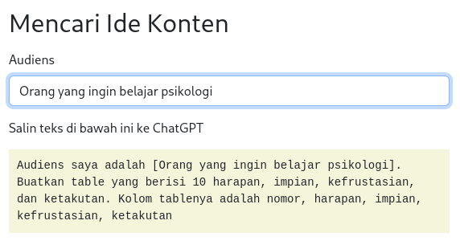
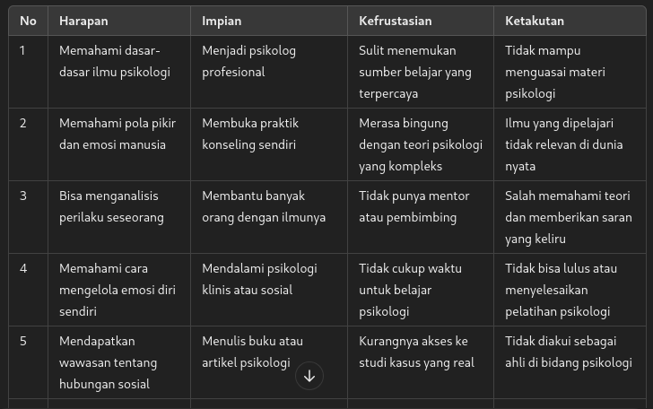
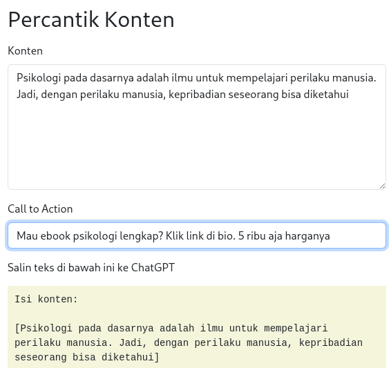

# Promosi di Threads

Gunakan Tools [Strategi Threads Viral](https://threads-era.github.io/) untuk memudahkanmu membuat konten

> Nggak ada waktu buat promosi? Gunakan jasa dari [Anak Startup](https://lynk.id/zenhacker/bkj3vdK)

## Mulai dari Mencari Ide Konten

Di tools tersebut, isi inputan audiens dengan ciri-ciri audiens.

Kemudian, salin teks prompt-nya ke ChatGPT.

Maka, kita akan mendapatkan hasil seperti ini:

Dari list ide tersebut, ambil satu, kemudian kembangkan menjadi sebuah konten dan diisikan di tools di bagian ini:

Nah, lalu hasil prompt-nya disalin ke ChatGPT.

Hasilnya tinggal disalin ke Threads.
